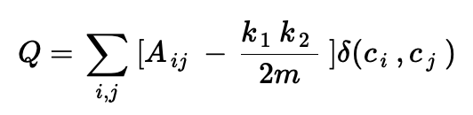
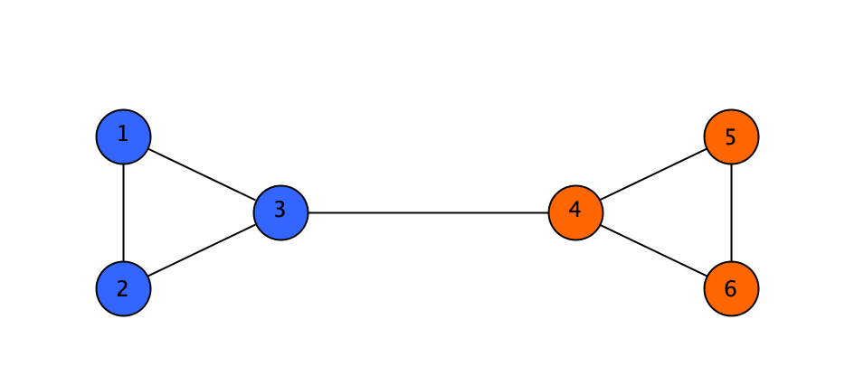
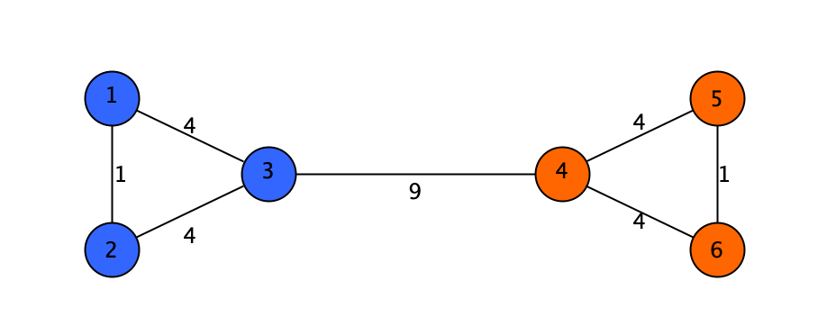

# 🏘 Girvan-Newman Community Detection
This is a C++ implementation of the Girvan-Newman community detection algorithm
as proposed [here](https://www.pnas.org/doi/full/10.1073/pnas.122653799) and 
refined [here](https://journals.aps.org/pre/abstract/10.1103/PhysRevE.69.026113) with use of 
the Boost Graph Library for C++.
The algorithm involves repeated calculations of edge betweeness, in which the edge with 
the highest score is removed and a modularity is calculated, which determines the density of
the community structure is. This is repeated until all edges are removed the partition with 
the highest modularity is chosen.

This implementation will show its functionality with use of the Football 2000 Dataset, which
can be found [here](http://www-personal.umich.edu/~mejn/netdata/)

## Installation
This project can be run in the commandline via g++, or by compiling in CLion using the CMakeLists.txt file with your 
chosen compiler. Below I will show you how to install g++.

First, check if g++ is installed.
```text
$ g++ --version
```
If it is not installed, install it.
```text
$ sudo apt-get install g++
```

## Usage
First, navigate to the project directory.
```bash
$ cd FullFilePathHere
```
Next, compile all the relevant files using g++
```bash
$ g++ src/main.cpp 
```
Run the program, this program takes 1 command line argument: the relative path to the
graphml dataset.

```bash
$ ./a.out data/dataset_1.graphml
```

## Datasets
The program uses files formatted using graphml, which is a way to organize vertices, edges, and their
respective properties. It is formatted with properties defined on the top of file, nodes listed below
with distinctive keys, and edges defined underneath.

An example of a small Graphml file with 2 nodes and 1 edge is shown below:
```text
<?xml version="1.0" encoding="UTF-8"?>
<graphml xmlns="http://graphml.graphdrawing.org/xmlns"  
    xmlns:xsi="http://www.w3.org/2001/XMLSchema-instance"
    xsi:schemaLocation="http://graphml.graphdrawing.org/xmlns
    http://graphml.graphdrawing.org/xmlns/1.0/graphml.xsd">
  <key id="d0" for="node" attr.name="community" attr.type="int"/>
  <graph id="G" edgedefault="undirected">
  
    <node id="n0">
      <data key="d0">1</data>
    </node>
    <node id="n1">
      <data key="d0">1</data>
    </node>
    
    <edge source="n0" target="n1"/> 
  </graph>
</graphml>
```

Note that the graphs used are undirected, unweighted graphs.

Randomly generated .graphml graphs were generated using the NetworkX python library 
and tested using the algorithm. The final testing dataset was converted from gml to graphml
using the same library.

## Algorithm Analysis 
The process in which the algorithm determines the separate partitions is with the help of edge
betweeness centrality, which is the frequency each node is used in all the shortest paths for each 
pair of nodes. Once a new partition is created, resulting in more unconnected clusters, a modularity 
is calculated, which measures the degree to which the partition is densely connected and can be separated
in to communities. We want a cluster that interacts more with itself more than other communities. 

The equation is shown as follows:



In basic terms, the modularity subtracts the total random or expected edges from each node in the community from
every actual edge. This is achieved by getting the sum of the current degrees of every node in the cluster 
minus the sum of the original degrees of every node in the cluster divided by 2 times the total original edge count.
This value is summed for every cluster and all divided by 2 times the total original edge count. 

The modularity is calculated for the graph every time a new component is formed and is saved if larger than the current
max. In general, a modularity between 0.3-0.7 is considered a good division of communities.

### Edge Betweeness 
Here is an example of how edges are removed in the algorithm. For each pair of nodes, the shortest path is calculated 
using Breadth First Search and path reconstruction.

Simple unweighted, undirected graph
```text
1-2
1-3
1-3-4
1-3-5
...
5-6
```
When following through these paths, the frequency is tracked to find the highest used path. This highest path is
then removed from the graph and the number of total components is calculated. Since the number of components
increased, the edge betweeness loop ends and the modularity is calculated and compared with the current max. This process
repeats until there are no more edges remaining, where the partition with the highest modularity is picked and is
printed in the report.


Graph with edge frequency


Graph after max edge is removed

### Testing
This implementation was tested using the Football Conference 2000 dataset provided by Girvan and Newman, which is a 
network containing American football games between colleges in 2000. Each node printed is accompanied by 
a value to indicate the correct conference they belong to (formatted as nodeID-conference). Here is the resulting clustering as reported by the 
algorithm: 

```text
Community Report
community #0: [0-7, 4-7, 9-7, 11-10, 16-7, 23-7, 24-10, 28-11, 41-7, 50-10, 69-10, 90-5, 93-7, 104-7]
community #1: [1-0, 25-0, 33-0, 37-0, 45-0, 89-0, 103-0, 105-0, 109-0]
community #2: [2-2, 6-2, 13-2, 15-2, 32-2, 39-2, 47-2, 60-2, 64-2, 100-2, 106-2]
community #3: [3-3, 5-3, 10-3, 40-3, 52-3, 72-3, 74-3, 81-3, 84-3, 98-3, 102-3, 107-3]
community #4: [7-8, 8-8, 21-8, 22-8, 51-8, 68-8, 77-8, 78-8, 108-8, 111-8]
community #5: [12-6, 14-6, 18-6, 26-6, 31-6, 34-6, 38-6, 42-5, 43-6, 54-6, 61-6, 71-6, 85-6, 99-6]
community #6: [17-9, 20-9, 27-9, 56-9, 62-9, 65-9, 70-9, 76-9, 87-9, 95-9, 96-9, 113-9]
community #7: [19-1, 29-1, 30-1, 35-1, 55-1, 79-1, 80-5, 82-5, 94-1, 101-1]
community #8: [36-5, 58-11, 59-10, 63-10, 97-10]
community #9: [44-4, 48-4, 57-4, 66-4, 75-4, 86-4, 91-4, 92-4, 112-4]
community #10: [46-11, 49-11, 53-11, 67-11, 73-11, 83-11, 88-11, 110-4, 114-11]
Modularity: 0.595356
```

For the most part, the algorithm was able to correctly cluster the teams with their respective groups. However,
some flaws are shown, mainly due to the presence of independent teams which don't belong in a formal conference. 
The algorithm also calculated a modularity score that is relatively high. Nevertheless, this output provides a
good starting point with many opportunities for optimization.

## Credits

This project was completed entirely by Daniel Ryan and
Zachary Suzuki for CS3353, Fundamentals of Algorithms taught by Dr. Fontenot.


